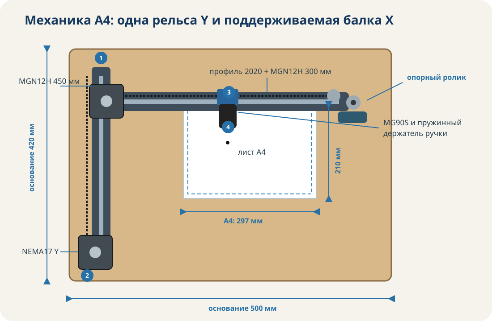
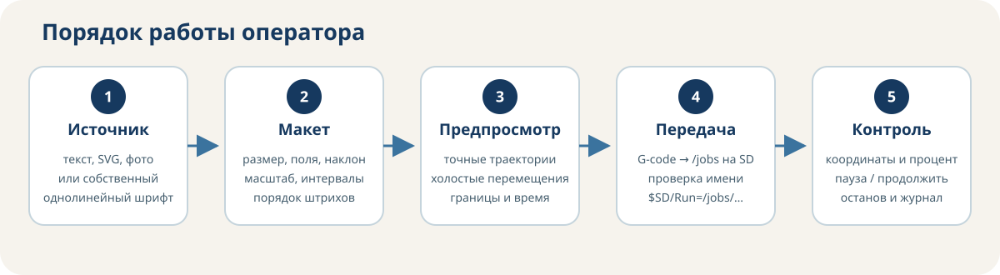

# ✒️ HandDraw ESP

**Автономный ЧПУ‑плоттер формата A4 на ESP32 для письма ручкой, технического текста, рисунков, SVG и фотографий.** Веб‑интерфейс хранится на самой ESP32 и работает без облака: браузер формирует траектории, показывает точный предпросмотр, создаёт G-code и передаёт задание в FluidNC.


## Что уже реализовано

- ESP32-контроллер **MKS DLC32 V2.1** и готовая конфигурация FluidNC.
- Декартова механика XY с неподвижным листом A4, ремнями GT2 и двумя NEMA17.
- Пружинный держатель ручки; MG90S работает как виртуальная ось Z.
- Полностью автономная WebUI: один сжатый файл около 36 КБ во flash ESP32.
- Русский однолинейный технический шрифт; для отсутствующих строчных используется регулируемое малое прописное начертание 35–100%.
- Редактор собственного почерка с автором, лицензией, шириной символов и несколькими вариантами буквы.
- Импорт и экспорт `.handdraw-font.json`.
- Управление размером, шириной, наклоном, межбуквенным, межсловным и межстрочным интервалами.
- Импорт SVG с развёртыванием линий, кривых Безье и дуг в траектории.
- Преобразование PNG/JPEG/WebP в штриховку или контуры.
- Поля листа, книжная/альбомная ориентация, масштабирование и оптимизация порядка штрихов.
- Предпросмотр **того же набора линий**, из которого создаётся G-code; показ холостых перемещений, выхода за лист и ускоренная симуляция порядка рисования.
- Оценка длины линий, холостого хода и времени.
- Запись задания в каталог `/jobs` SD-карты через штатный файловый API FluidNC; WebDAV используется как резерв. HTTP-монтирование этого каталога — `/sd/jobs`.
- Запуск, пауза, продолжение, останов, homing, jog и подъём пера.
- Отображение координат, состояния, текущего файла и процента выполнения из WebSocket-отчётов FluidNC.
- Параметрические детали OpenSCAD, полный BOM с 3–4 вариантами покупки на позицию и пошаговые инструкции.


Схема экранов и потоков: [docs/images/web-ui.svg](docs/images/web-ui.svg).

## Принятая конструкция

| Узел | Решение |
|---|---|
| Контроллер | MKS DLC32 V2.1, ESP32-WROOM, FluidNC |
| Рабочее поле | 225 × 315 мм |
| Лист | A4, неподвижный |
| Основание | берёзовая фанера 420 × 500 × 12 мм |
| Ось Y | MGN12H 450 мм, **две** каретки |
| Ось X | профиль 2020 330–350 мм + MGN12H 300 мм |
| Передача | GT2, ширина 6 мм, шкивы 20T |
| Двигатели | 2 × NEMA17, 1,8°, 35–45 Н·см |
| Драйверы | TMC2209 StepStick, автономный STEP/DIR |
| Масштаб | 80 шагов/мм при микрошаге 1/16 |
| Подъём пера | позиционный MG90S 180°, Z0 вниз / Z5 вверх |
| Питание | адаптер 12 В / 5 А; отдельный DC/DC 5 В для серво |
| Хранилище заданий | SD-карта, каталог `/jobs`; HTTP-путь `/sd/jobs` |



## С чего начать

Единая пошаговая инструкция от закупки до первого рисунка: **[docs/START_HERE.md](docs/START_HERE.md)**.

Она задаёт обязательный порядок: закупка критичных деталей → измерение → пробная 3D-печать → механика → электрика → прошивка → WebUI → калибровка.

## Подготовка и прошивка FluidNC

Репозиторий не хранит устаревающую копию стороннего бинарного файла. Скрипт получает последний стабильный официальный release FluidNC, выбирает пакет для текущей ОС, фиксирует SHA-256 и при явном разрешении запускает штатный установщик:

```bash
# Только скачать и распаковать официальный пакет
python3 scripts/install_fluidnc.py

# Показать найденные assets последнего релиза
python3 scripts/install_fluidnc.py --list-assets

# Запустить официальный Wi-Fi-установщик; 12 В и периферия должны быть отключены
python3 scripts/install_fluidnc.py --flash
```

Стирание контроллера и замена локальной файловой системы выполняются только отдельными флагами `--erase` и `--install-fs`. Полная инструкция: [firmware/fluidnc/INSTALL.md](firmware/fluidnc/INSTALL.md).

## Хранение крупных исходников

Чтобы проект можно было надёжно публиковать через GitHub API, крупные автономные исходники хранятся воспроизводимыми частями в `packed/`. Команда `python3 scripts/materialize_sources.py` восстанавливает WebUI и закупочные таблицы с проверкой SHA-256. `npm test`, `npm run build` и `scripts/setup_project.py` выполняют это автоматически.

## Быстрый запуск программной части

Требуются Python 3.10+ и, только для тестов вычислительного ядра, Node.js 20+.

```bash
# 1. Однократно подготовить окружение и проверить проект
python3 scripts/setup_project.py

# 2. Собрать автономную страницу
python3 scripts/build_webui.py

# 3. Подготовить переносимый комплект контроллера
python3 scripts/prepare_controller_bundle.py

# 4. Загрузить интерфейс на ESP32
python3 scripts/deploy_webui.py 192.168.1.50

# Одновременно передать config.yaml — только после проверки распиновки
python3 scripts/deploy_webui.py 192.168.1.50 --with-config
```

Скрипт создаёт `dist/index.html.gz`, загружает его как `/flash/index.html.gz` и проверяет записанные байты. После этого интерфейс открывается по адресу ESP32.

Для локального просмотра без станка:

```bash
python3 scripts/serve_webui.py
# открыть http://127.0.0.1:8765/
```

Дополнительная браузерная проверка собранной автономной страницы:

```bash
python -m pip install playwright
CHROMIUM_PATH=/usr/bin/chromium python3 tests/browser_smoke.py
```

В локальном режиме подготовка макетов, шрифтов, SVG и G-code работает; команды станка недоступны.

## Порядок сборки

1. Сначала приобрести направляющие, сервопривод, двигатели и переключатели.
2. Измерить фактические размеры клонов штангенциркулем.
3. Настроить параметры в `hardware/cad/plotter_parts.scad`.
4. Напечатать проверочный купон и тестовые посадки.
5. Собрать основание и ось Y, затем перпендикулярную балку X.
6. Установить ремни без чрезмерного натяжения.
7. Собрать подпружиненный держатель и добиться свободного вертикального хода.
8. Выполнить проводку, выставить DC/DC ровно на 5,0 В и только затем подключить MG90S.
9. Загрузить FluidNC и конфигурацию; первый запуск выполнить без ручки.
10. Проверить концевики, направления, квадрат 100 × 100 мм и только после этого рисовать на бумаге.

Подробно: [сборка](hardware/ASSEMBLY.md), [проводка](hardware/WIRING.md), [печать деталей](hardware/PRINTING.md), [калибровка](docs/CALIBRATION.md).



## Основные каталоги

```text
firmware/fluidnc/       конфигурация ESP32/FluidNC
web/src/                исходники автономного интерфейса
dist/                   собранный index.html и манифест
hardware/cad/           параметрические 3D-детали OpenSCAD
hardware/bom.csv        полный закупочный перечень
hardware/bom.json       BOM для автоматической обработки
gcode/                  безопасные проверочные задания
docs/                   архитектура, WebUI, калибровка и безопасность
scripts/                настройка, сборка, комплект контроллера, развёртывание и проверки
release/                локально создаваемый комплект для ESP32 (не хранится в Git)
tests/                  тесты геометрии, шрифта, растра и G-code
```

## Документация

- [Архитектура ПО и поток данных](docs/ARCHITECTURE.md)
- [Веб-интерфейс и функции оператора](docs/WEB_INTERFACE.md)
- [Формат пользовательского шрифта](docs/FONT_FORMAT.md)
- [Полный маршрут сборки и запуска](docs/START_HERE.md)
- [Установка FluidNC и WebUI](docs/DEPLOYMENT.md)
- [Первичная прошивка ESP32](firmware/fluidnc/INSTALL.md)
- [Калибровка](docs/CALIBRATION.md)
- [Безопасность](docs/SAFETY.md)
- [Исходные технические источники](docs/SOURCES.md)
- [Закупка](hardware/BOM.md)
- [3D-печать](hardware/PRINTING.md)
- [Механическая сборка](hardware/ASSEMBLY.md)
- [Электрическая схема](hardware/WIRING.md)

## Ограничения

- Обычный TTF/OTF превращается в двойные контуры и напрямую не используется. Для письма применяется штриховой шрифт.
- SVG-текст необходимо предварительно преобразовать в кривые либо набрать во встроенном редакторе текста.
- Растровое изображение не воспроизводит полутона краской: они аппроксимируются длиной и плотностью штрихов.
- Параметры OpenSCAD являются инженерной отправной точкой. У клонов MGN12H и MG90S размеры отличаются.
- Программная часть проверена автоматическими тестами и Chromium. Физическая точность зависит от конкретной сборки и должна подтверждаться калибровкой.
- Во время движения нельзя перезагружать WebUI: состояние и процент приходят по WebSocket, а обслуживание файлов ESP32 может мешать реальному времени.

## Безопасность

Это движущийся электромеханический станок. Первый пуск выполняется без ручки, на малой скорости и с доступным отключением 12 В. Сервопривод нельзя питать от 12 В. Драйверы StepStick запрещено устанавливать или вынимать при поданном питании. Программная кнопка «Стоп» не заменяет аппаратное снятие питания.

Лицензия программного кода и моделей: `GPL-3.0-or-later`.
