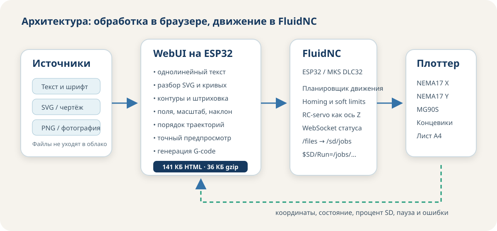
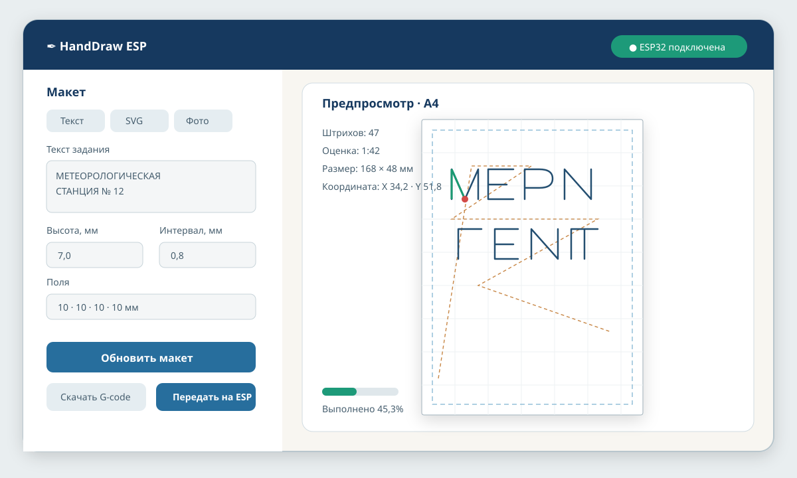

# ✒️ HandDraw ESP

**Автономный ЧПУ-плоттер формата A4 на ESP32 для письма ручкой, технического текста, рисунков, SVG и растровых изображений.** Веб-интерфейс хранится на контроллере и работает без облака: браузер формирует траектории, показывает предпросмотр, создаёт G-code и передаёт задание в FluidNC.



## Состояние проекта

Программная часть и конфигурация FluidNC имеют автоматические проверки. Механика переведена из набора отдельных эскизных деталей в единую параметрическую сборку с общей системой координат, сопряжёнными креплениями, крайними положениями и расчётом рабочего хода.

Физическая воспроизводимость ещё должна быть подтверждена на купленных компонентах. До публикации результатов контрольной сборки проект следует считать **инженерным прототипом**, а не готовым набором для безусловной печати всех деталей.

Обязательный порядок:

1. приобрести только геометрически критичные компоненты;
2. измерить их по [`hardware/MEASUREMENTS.md`](hardware/MEASUREMENTS.md);
3. перенести размеры в [`hardware/cad/component_dimensions.scad`](hardware/cad/component_dimensions.scad);
4. выполнить CAD-проверки;
5. напечатать контрольные посадки;
6. только после этого печатать рабочий комплект.

План устранения исходных несогласованностей и критерии завершения: [`docs/CAD_REWORK_PLAN.md`](docs/CAD_REWORK_PLAN.md).

## Что реализовано

- контроллер **MKS DLC32 V2.1** на ESP32 и конфигурация FluidNC;
- декартова механика XY с неподвижным листом A4, ремнями GT2 и двумя NEMA17;
- одна направляющая Y с двумя каретками и поддерживаемая роликом балка X;
- пружинный держатель ручки; MG90S работает как виртуальная ось Z;
- единая параметрическая OpenSCAD-сборка с состояниями `home`, `center`, `max`;
- отдельные параметры покупных компонентов и измерительная ведомость;
- расчёт физического хода, масштаба привода и базовых силовых запасов;
- статический CAD-валидатор и полная компиляция деталей OpenSCAD в GitHub Actions;
- полностью автономная WebUI в одном сжатом файле;
- русский однолинейный технический шрифт;
- редактор собственного почерка и формат `.handdraw-font.json`;
- импорт SVG;
- преобразование PNG/JPEG/WebP в штриховку или контуры;
- точный предпросмотр того же набора линий, из которого создаётся G-code;
- оценка длины линий, холостого хода и времени;
- загрузка задания на SD-карту FluidNC;
- запуск, пауза, продолжение, останов, homing, jog и управление пером;
- отображение координат, состояния и процента выполнения.



## Принятая конфигурация

| Узел | Решение |
|---|---|
| Контроллер | MKS DLC32 V2.1, ESP32-WROOM, FluidNC |
| Управляемое поле | 225 × 315 мм |
| Лист | A4 210 × 297 мм, портретная физическая установка |
| Основание | берёзовая фанера 420 × 500 × 12 мм |
| Ось Y | MGN12H 450 мм, две каретки, расстояние центров 52 мм |
| Ось X | профиль 2020 длиной 350 мм + MGN12H 300 мм |
| Передача | GT2, 6 мм, шкивы 20T |
| Двигатели | 2 × NEMA17, 1,8°, целевой класс 40–45 Н·см |
| Драйверы | TMC2209 StepStick, автономный STEP/DIR |
| Масштаб | 80 шагов/мм при микрошаге 1/16 |
| Подъём пера | позиционный MG90S 180°, Z0 вниз / Z5 вверх |
| Питание | 12 В / 5 А; отдельный DC/DC 5 В для серво |
| Хранилище | SD-карта, каталог `/jobs`; HTTP-путь `/sd/jobs` |

При номинальной геометрии расчётный физический ход составляет:

```text
X: 238,6 мм, резерв относительно поля 13,6 мм
Y: 336,6 мм, резерв относительно поля 21,6 мм
```

Это расчёт, а не результат приёмочных испытаний. После получения направляющих необходимо повторить вычисление по фактическим размерам кареток, торцевых зон и концевиков.

Прямой альбомный лист 297 × 210 мм не помещается по физической оси X=225 мм. Альбомное задание допустимо только после программного поворота траектории в портретной установке листа и отдельной проверки этого режима.

## Работа с CAD

Открыть:

```text
hardware/cad/plotter_parts.scad
```

Основные режимы:

```scad
part = "assembly";
assembly_state = "center"; // home | center | max
```

Проверка крайних положений:

```scad
part = "motion_envelope";
```

Разнесённая сборка:

```scad
part = "exploded";
```

Статическая проверка:

```bash
python3 scripts/validate_cad.py
```

Проверка с реальной компиляцией всех деталей в установленном OpenSCAD:

```bash
python3 scripts/validate_cad.py --strict --render-all
```

Альтернативные команды:

```bash
make cad
make cad-openscad
npm run test:cad
npm run test:cad:openscad
```

Подробное описание интерфейсов и экспорта: [`hardware/cad/README.md`](hardware/cad/README.md).

## С чего начать

Единый маршрут от закупки до первого рисунка: [`docs/START_HERE.md`](docs/START_HERE.md).

Закупка выполняется шлюзами, а не одной операцией:

- сначала направляющие, профиль, приводы, серво, ролики, концевики и плата;
- затем измерение и контрольные печати;
- после сухой сборки — окончательный крепёж, проводка, питание и корпус.

Закупочные критерии: [`hardware/BOM.md`](hardware/BOM.md).

## Подготовка программной части

Требуются Python 3.10+ и Node.js 20+.

```bash
python3 scripts/setup_project.py
python3 scripts/build_webui.py
python3 scripts/prepare_controller_bundle.py
```

Локальный просмотр WebUI без станка:

```bash
python3 scripts/serve_webui.py
# открыть http://127.0.0.1:8765/
```

Полная проверка проекта:

```bash
npm test
```

Браузерная проверка:

```bash
python -m pip install playwright
CHROMIUM_PATH=/usr/bin/chromium python3 tests/browser_smoke.py
```

## Прошивка FluidNC

Репозиторий не хранит сторонние бинарные файлы FluidNC. Помощник получает официальный пакет и делегирует прошивку штатному установщику:

```bash
# Скачать и распаковать пакет
python3 scripts/install_fluidnc.py

# Показать доступные файлы выпуска
python3 scripts/install_fluidnc.py --list-assets

# Запустить официальный Wi-Fi-установщик
python3 scripts/install_fluidnc.py --flash
```

Во время прошивки внешний источник 12 В, двигатели и MG90S должны быть отключены. Операции `--erase` и `--install-fs` выполняются только явно.

Полная инструкция: [`firmware/fluidnc/INSTALL.md`](firmware/fluidnc/INSTALL.md).

## Развёртывание WebUI

```bash
python3 scripts/deploy_webui.py 192.168.1.50
```

Передавать конфигурацию следует только после проверки точной ревизии платы и распиновки:

```bash
python3 scripts/deploy_webui.py 192.168.1.50 --with-config
```

Сценарий создаёт `dist/index.html.gz`, загружает его в `/flash/index.html.gz` и проверяет записанные байты.

## Порядок аппаратной реализации

1. Заказать критичные компоненты по шлюзу A.
2. Заполнить копию `hardware/measurements.example.csv`.
3. Обновить `component_dimensions.scad`.
4. Выполнить `validate_cad.py`.
5. Просмотреть `motion_envelope` в OpenSCAD.
6. Напечатать `fit_coupon`, одно седло, ползун, зажим ремня и кронштейн MG90S.
7. Исправить реальные посадки.
8. Напечатать силовые детали.
9. Выполнить сухую сборку без ремней и электрики.
10. Проверить весь ход вручную.
11. Установить ремни и приводы.
12. Выполнить электрический пуск без ручки.
13. Проверить концевики и homing.
14. Выполнить рамку с поднятым пером.
15. Провести калибровку квадрата, диагоналей и повторного прохода.

Подробно:

- [измерение](hardware/MEASUREMENTS.md);
- [печать](hardware/PRINTING.md);
- [сборка](hardware/ASSEMBLY.md);
- [проводка](hardware/WIRING.md);
- [калибровка](docs/CALIBRATION.md);
- [безопасность](docs/SAFETY.md).

## Основные каталоги

```text
firmware/fluidnc/       конфигурация ESP32/FluidNC
web/src/                исходники автономного интерфейса
dist/                   собранный index.html и манифест
hardware/cad/           параметрическая сборка и детали OpenSCAD
hardware/                BOM, измерение, печать, механика и проводка
gcode/                  безопасные проверочные задания
docs/                   архитектура, развёртывание и планы валидации
scripts/                сборка, развёртывание и автоматические проверки
release/                локально создаваемый комплект контроллера
tests/                  тесты геометрии, шрифта, растра и G-code
```

## Ограничения

- Обычный TTF/OTF создаёт двойные контуры; для письма применяется штриховой шрифт.
- SVG-текст нужно преобразовать в кривые либо набрать во встроенном редакторе.
- Полутона растра аппроксимируются штрихами и контурами.
- Размеры клонов MGN12H, MG90S, концевиков и плат различаются.
- Расчётный ход не заменяет физическую проверку столкновений.
- Корпус MKS DLC32 нельзя печатать как финальный до измерения конкретной подревизии.
- Настройка TMC2209 зависит от точного двигателя, ревизии драйвера и Rsense.
- Во время движения не следует перезагружать WebUI или выполнять операции с файлами без необходимости.

## Безопасность

Первый пуск выполняется без ручки, на малой скорости и с доступным аппаратным отключением 12 В. MG90S нельзя питать от 12 В. StepStick нельзя устанавливать или извлекать при поданном питании. Программная кнопка «Стоп» не заменяет аппаратное снятие питания.

Лицензия программного кода и оригинальных моделей: `GPL-3.0-or-later`.
