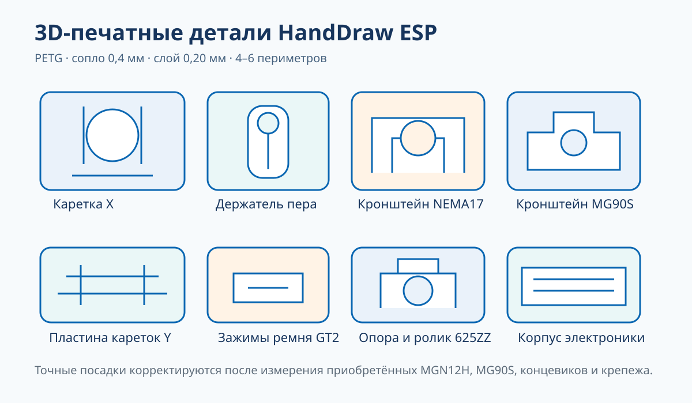

# 3D-печать деталей

Параметрический файл: [`cad/plotter_parts.scad`](cad/plotter_parts.scad).



> Иллюстрация показывает назначение деталей; STL формируются из параметрического OpenSCAD после измерения конкретных компонентов.

В начале файла выбирается:

```scad
part = "pen_body";
```

Затем выполнить F6 и экспорт STL.

## Почему сначала нужны купленные детали

MGN12H, MG90S, концевики и даже платы MKS у разных производителей отличаются на десятые доли и миллиметры. Перед серийной печатью измерить:

- сетку отверстий кареток;
- длину и ширину корпуса MG90S;
- расстояние между монтажными ушами;
- диаметр ручки;
- реальный размер термовставок;
- шаг отверстий микропереключателя.

Основные параметры в SCAD:

```scad
clearance = 0.30;
insert_m3_d = 4.70;
mgn_hole_x = 20;
mgn_hole_y = 20;
pen_d = 10.2;
servo_body = [23.0, 12.5, 29.0];
servo_ear_span = 32.5;
```

## Детали

| `part` | Деталь | Кол-во | Материал | Слой | Периметры | Заполнение |
|---|---|---:|---|---:|---:|---:|
| `plate` | пластина двух кареток Y | 1 | PETG | 0,20 | 5 | 40% gyroid |
| `x_carriage` | каретка X | 1 | PETG | 0,20 | 5 | 40% |
| `pen_body` | корпус держателя | 1 | PETG | 0,16 | 5 | 45% |
| `pen_slider` | подвижная цанга | 1 | PETG | 0,16 | 4 | 40% |
| `pen_cap` | крышка пружины | 1 | PETG | 0,20 | 4 | 40% |
| `servo_bracket` | кронштейн MG90S | 1 | PETG | 0,20 | 5 | 45% |
| `motor_mount` | кронштейн NEMA17 | 2 | PETG | 0,20 | 5 | 45% |
| `idler_mount` | кронштейн ролика | 2 | PETG | 0,20 | 5 | 45% |
| `belt_clamp` | зажим GT2 | 4 | PETG/PA | 0,16 | 6 | 80–100% |
| `support_roller` | опора правого конца | 1 | PETG | 0,20 | 5 | 45% |
| `endstop` | кронштейн концевика | 2 | PETG | 0,20 | 4 | 35% |
| `electronics_base` | корпус платы | 1 | PETG | 0,24 | 3 | 20% |
| `electronics_lid` | крышка | 1 | PETG | 0,24 | 3 | 20% |
| `cable_clip` | кабельная клипса | 6 | PETG | 0,20 | 4 | 35% |
| `fit_coupon` | купон термовставок | 1 | тот же пластик | 0,20 | 4 | 100% |

Сопло: 0,4 мм.

## Ориентация

- Пластины и каретки — большой плоскостью на стол.
- Моторные и роликовые кронштейны — основанием вниз.
- Корпус пера и ползун — вертикально.
- Зажим GT2 — зубцами вверх, чтобы профиль не потерялся на первом слое.
- Корпус электроники — дном вниз.

Основные детали рассчитаны на печать без поддержек. Локальная поддержка может понадобиться кронштейну серво в зависимости от ориентации и возможностей принтера.

## Последовательность печати

1. `fit_coupon`.
2. Короткий фрагмент `pen_body` и `pen_slider` либо полные детали с малым заполнением.
3. Один `belt_clamp`.
4. Один `motor_mount` и проверка NEMA17.
5. `servo_bracket` и проверка MG90S.
6. Остальные силовые детали.
7. Корпус электроники после примерки платы.

## Допуски

`clearance = 0.30` означает боковой зазор в модели, но реальный результат зависит от калибровки потока и горизонтального расширения. Подвижный ползун должен проходить без усилия и без ощутимого качания. Не исправлять тугую посадку чрезмерной силой: изменить параметр и перепечатать.

PLA допустим для примерки. Для рабочего станка предпочтителен PETG. Детали рядом с двигателем не печатать из мягкого PLA при высокой температуре окружающей среды.
