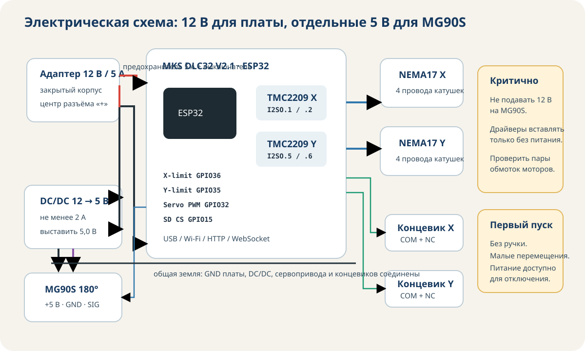

# Электрическая схема



Монтажная схема: [docs/images/wiring.svg](../docs/images/wiring.svg). Для подключения использовать таблицы и проверочные операции на этой странице.

## Питание

```text
адаптер 12 В / 5 А
  ├─ предохранитель 5 А ─ выключатель ─ MKS DLC32 VIN
  └─ DC/DC 12→5 В ─ MG90S +5 В

GND адаптера ─ MKS GND ─ DC/DC GND ─ MG90S GND
```

Перед сервоприводом DC/DC выставляется на 5,0 В без нагрузки. После подключения проверить напряжение во время движения серво; заметная просадка указывает на слабый преобразователь или провод.

## Карта выводов

| Функция | FluidNC / MKS DLC32 V2.1 |
|---|---|
| общий enable драйверов | `I2SO.0` |
| X STEP | `I2SO.1` |
| X DIR | `I2SO.2` |
| Y STEP | `I2SO.5` |
| Y DIR | `I2SO.6:low` |
| X limit | `gpio.36` |
| Y limit | `gpio.35` |
| PWM MG90S | `gpio.32` |
| I2S BCK | `gpio.16` |
| I2S DATA | `gpio.21` |
| I2S WS | `gpio.17` |
| SD CS | `gpio.15` |

Сигнал MG90S подключается к TTL/PWM GPIO32, питание — только к внешним 5 В. Земля общая.

## Двигатели

Определить пары обмоток омметром. У одной пары есть малое сопротивление между двумя проводами. Подключить:

```text
пара 1 → A1/A2
пара 2 → B1/B2
```

Если двигатель вращается в неверную сторону, при снятом питании поменять местами A1/A2 **либо** изменить `direction_pin`. Не менять оба одновременно.

## TMC2209

- Проверить маркировку `VMOT`, `GND`, `VIO`, `DIR`, `STEP`, `EN` на конкретном модуле и шелкографию платы.
- Установить радиатор.
- Начать с умеренного тока.
- После 10 минут движения проверить температуру.
- Не замыкать диагностические/UART-перемычки без необходимости: проект использует standalone STEP/DIR.

## Концевики

Рекомендуемая схема — нормально замкнутая:

```text
COM → GND
NC  → вход limit
NO  → не используется
```

Преимущество NC: обрыв провода обнаруживается как активный вход. Фактическую полярность проверить командой состояния и при необходимости добавить `:low` в конфигурацию.

## Провод

| Цепь | Рекомендация |
|---|---|
| 12 В | многожильный AWG18 |
| моторы | 4 × AWG22 |
| 5 В серво | AWG22 |
| концевики и PWM | AWG26 |

В винтовые клеммы многожильный провод устанавливать через НШВИ, а не лужёный конец.

## Предварительная проверка

1. Снять драйверы и сервопривод.
2. Проверить отсутствие короткого замыкания между 12 В и GND.
3. Подать питание на плату.
4. Проверить 12 В и 5 В.
5. Снять питание.
6. Установить драйверы.
7. Подключить по одному мотору.
8. Подключить концевики.
9. В последнюю очередь подключить MG90S.
